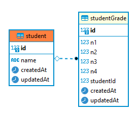

# Grades api

Grades api: consists of 2 APIs, one for creating and updating grades and one for querying grades

## Technologies:

- Node
- Typescript
- NestJs
- Jest
- TypeOrm
- Postgresql
- Swagger

## Functionalities:

### Admin api:

- Create or Update grades
- List all grades

### Student api:

- querying student grades

## Database structure:

<div>
  
</div>

## System requirements:

- Node 16.10+
- Postgresql 9.0+
- Yarn 1.22+

## Installation:

```bash
# Clone project
git clone https://github.com/julioantonini/grades-api.git

# Enter in project folder
cd grades-api

# install depencencies

yarn install
# install depencencies
```

create the .env file based on the .env.example file in the project root directory and configure the environment variables according to your database,
then run the commands below:

```bash
# install depencencies
yarn install

# build project
yarn build

# update database
yarn db:update
```

How to start apis:

```bash
# start admin api
yarn start:grades-api-admin:prod

# start student api
yarn start:grades-api:prod
```

Student api documentation
http://localhost:3000/api/

Admin api documentation
http://localhost:3001/api/

#### Project date:

February 2022
